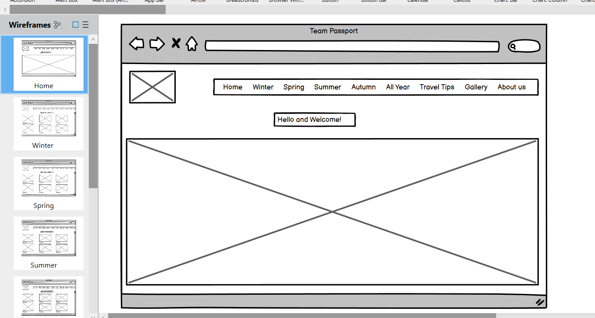

# Passport
About Passport Travels is a platform designed to inspire and inform travelers about various destinations. It includes details about places to visit, things to do, and where to stay, along with practical information about languages, currency, and safety. ## Features - Explore different travel destinations with stunning visuals. - Get insights into local languages, currency, and safety tips. - Discover top-rated hotels and accommodations for your stay. - Find recommended restaurants, clubs, and bars for a memorable dining experience. - Watch videos showcasing the beauty of various destinations.

# Getting Started
Make sure you have the following installed: - Web browser - Code editor (e.g., Visual Studio Code) 
1. Clone the repository
2. Open the project in your code editor.
3. Open index.html in your web browser to view the main page.

Explore different sections like "About Us," "Summer Destinations," and "Gallery."
Click on the navigation links to discover more about each destination.

# UX
Userstories 
1. As a user, I want a user-friendly website that allows me to quickly find and filter activities.
2. As a user, I want, recommendations based on my preferences and past bookings, guiding me to discover new destinations aligned with my interests.
Budget-Friendly Alerts:
3. As a user, I want real-time alerts for price drops and special deals on flights, accommodations, and packages to help me save money on my travels.
4. As a user, I want a comprehensive travel guidebook covering not just transportation and accommodation but also offering suggestions for local attractions, dining, and transportation options at the destination.
5. As a user, I want access to detailed information about popular travel destinations, including local attractions, cultural events, and recommended activities. This enables me to plan my itinerary more effectively.
6. As a user, I want personalized travel recommendations based on star ratings (such as 5-star exclusive or 1-star budget) to help me discover new and exciting destinations that align with my interests.

# Existing Features

1. Navigation System:
Our navigation system is more than just a set of links; it's a carefully designed roadmap for your journey on Passport Travels.
Responsive Menu: The inclusion of a responsive menu ensures that whether you're exploring on a desktop, tablet, or smartphone, the navigation adapts seamlessly, providing an intuitive and accessible user experience.
Logical Structure: We've organized the navigation with a clear hierarchy, making it easy for users to find what they're looking for. From "Home" to "Summer Destinations," each section has its place, guiding users through the richness of our content.
User-Centric Approach: The revamped navigation is designed with you in mind, focusing on simplicity, clarity, and ease of use. It's not just a menu; it's a pathway to your travel discoveries.
2. Logo Image:
Our logo is more than an image; it's a visual representation of Passport Travels' identity and commitment to your wanderlust.
Symbol of Exploration: The Passport icon in our logo symbolizes the spirit of exploration and adventure. It signifies the gateway to diverse destinations and experiences, inviting you to embark on a journey with us.
Brand Recognition: A distinctive logo is crucial for brand recognition. The Passport Travels logo stands out, making it memorable and instantly recognizable as a symbol of your go-to travel companion.
Cohesive Aesthetics: The logo's design aligns with the overall aesthetics of our website, creating a cohesive and visually appealing brand image. It's not just a logo; it's a visual story of our passion for travel.
3. Header Elements:
The header of Passport Travels is more than a collection of images and text; it's a gateway to the immersive world of travel.
Header Image: The carefully chosen header image, featuring a stunning sunrise over the ocean, sets the tone for the entire website. It's not just a picturesque view; it's an invitation to explore the beauty of our destinations.
Navigation Toggle: The navigation toggle, represented by the hamburger icon, ensures a clutter-free header on smaller screens. It's a design choice that prioritizes simplicity and functionality, allowing you to focus on the content that matters.
4.Footer Elements:
A footer provided a consistent place for important links and information, making it easy for users to navigate or find essential details about the website. Which included copyright information and privacy policies.

# Testing
We employed two testing tools to ensure the error-free nature of our code. we utilized validator testing tools, such as:
1. Nu Html Checker (w3.org): identifies potential issues affecting webpage functionality.
2. W3C CSS Validator for TextArea (CSS level 3 + SVG): identifies and highlighting errors or warnings that may impact the styling of our web pages.

During the validation process, errors were detected, signifying areas for improvement. Recognizing and addressing these syntax errors is crucial for ongoing development, ensuring our code remains free of potential issues. Moving forward, we are committed to addressing identified problems and to uphold code quality.

# Responsive Test

# Issues Fixed
1. HTML (index.html):
Fixed the broken navigation link for "About Us."
Updated the links in the navigation bar to point to the correct HTML files (aboutus.html, summerdestination.html, gallery.html).
Corrected the duplicated id attribute in the 
 with the id="responsive-image" by changing it to a class.
Ensured that images are self-closing ().
Organized the structure of the HTML document for better readability.
2. CSS (style.css, style2.css):
Enhanced overall styling for a more visually appealing look.
Streamlined CSS rules and added comments for better organization.
Adjusted font sizes, margins, and paddings for better responsiveness.
Modified the navigation bar styling.
Improved the styling of the hero section.
Made the layout more flexible using flex containers.
Adjusted media queries for better responsiveness on various screen sizes.
3. Additional Files:
Created aboutus.html and gallery.html with placeholder content.
4. File Cleanup:
Removed unnecessary and duplicated styles.
Ensured proper indentation and formatting for better code readability.

# Deployment
We deployed the project with the following steps:
Access Repository Settings:
1.	Navigate to the "Settings" tab of your GitHub repository.
Navigate to Pages Section:
2.	In the left-hand sidebar, select the "Code and automation" section, and then choose "Pages."
3.	Ensure that the Source is set to 'Deploy from Branch,' and set the Folder to / (root).
4.	Save the changes under the Branch section.
This sequence of steps outlines our successful deployment of the project on GitHub.

# Credits
The links for section Travel tips were copied from Google search. The photos used in this site were obtained from Unsplash and Google images. We received inspiration for this project from travel blogs. 
The Top destinations ranking was based on Travel website research.

